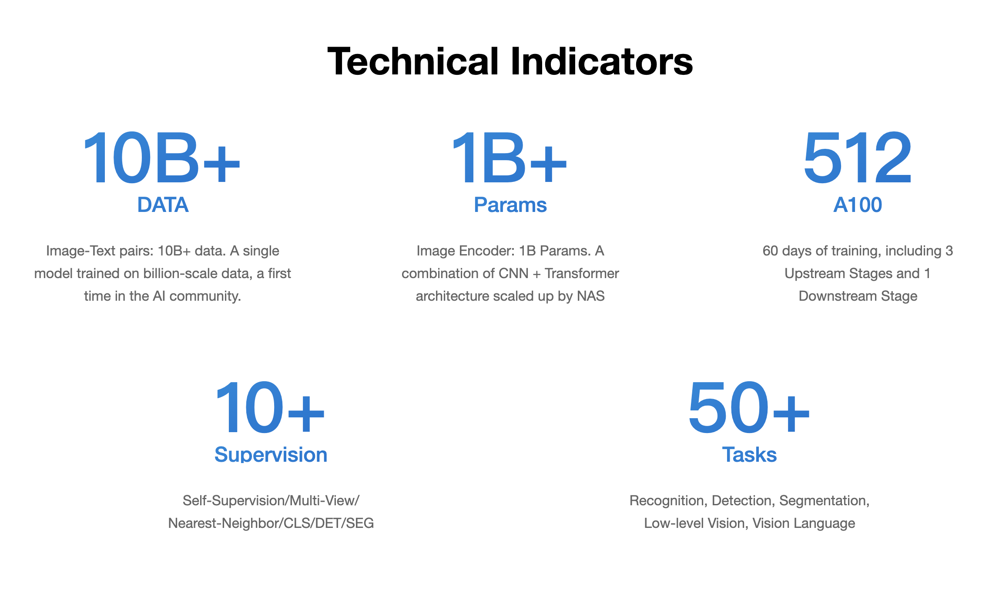
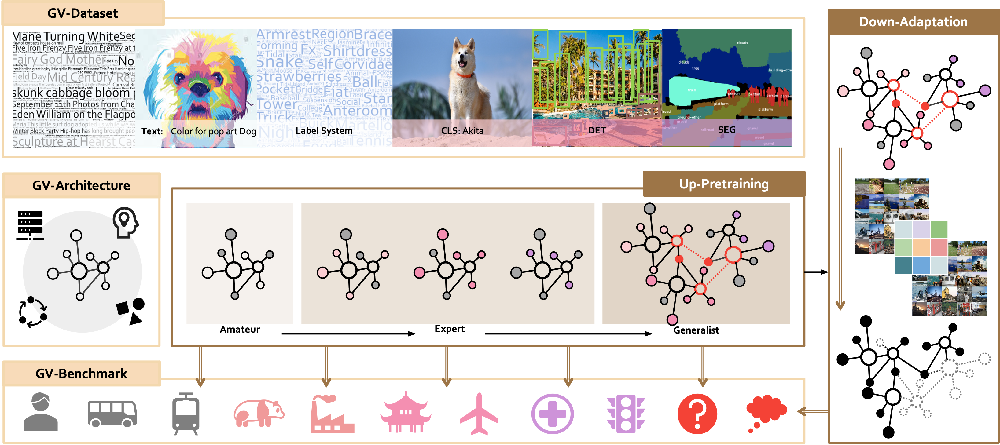

### Detailed Documentation

* [Large-scale open source dataset](data.md)
* [INTERN released models](model.md)
* [OpenGV Benchmark](benchmark.md)

### Open source ecosystem OpenGVLab 

OpenGVLab, an open source general vision platform based on "INTERN", releases pre-training models and their usage information, datasets and evaluation benchmarks to industry and academia. OpenGVLab, together with OpenMMLab and OpenDILab, previously released by Shanghai Artificial Intelligence Laboratory and SenseTime, will jointly build OpenXLab, an open source system designed to help fundamental research and promote the general artificial intelligence ecosystem.

1. Data: Gradually release datasets for tasks including classification, detection, and segmentation as well as large-scale annotations, which is expected to become the largest open source image dataset.
2. Model: The pre-trained model will be divided into small, medium, and super large models. The small and medium models will gradually include models for common network architechtures, and will be open to download, and the super large models will be available through inference services.
3. Evaluation system: Publish a comprehensive benchmark suite for general visual models, covering multiple evaluation benchmark tasks under settings such as fewshot and zero-shot.

### Why do we need general vision?

* Generalizing tasks and training data training efficiency are the core bottlenecks restricting current AI development.
     * An AI model is only good at handling one task. When faced with ever-changing task requirements, thousands of AI models need to be developed independently
     * Each AI model needs to build a separate labeled dataset for special training
* Large-scale training towards general models is a current research hotspot
* Building scalable large-scale datasets is one of the key factors
* Building large-scale downstream task standards and platforms for benchmarking serving industry and academia

### INTERN features

1. 10 billion+ image-text paired data samples, an unprecedented scale for open-source datasets
2. The general vision model released by this project have 1 billion+ learnable parameters, sufficient model capacity to support training of massive datasets
3. Trained on 512 Nvidia A100 graphics cards for 60 days
4. The training procedure involves 10+ supervised label categories, encouraging generality through label diversity.
5. From training to evaluation, the process involves 50+ vision-related tasks, fully achieving general vision training and evaluation.

### How does OpenGVLab fit in INTERN

INTERN consists of seven key components. Three of them serve as fundamental bases: General Vision Dataset is constructed as the database for the upstream step-wise learning process of INTERN. General Vision Architecture is the backbone of INTERN models. General Vision Benchmark consists of a broad range of downstream datasets and evaluation settings to assess the generalization ability of vision models thoroughly. The other four refer to our upstream pretraining scheme with three stages (i.e. Upstream-Amateur, Upstream-Expert, and Upstream-Generalist) and Downstream-Adaptation, which provides a refined solution to adapting learned upstream general models towards various types of downstream tasks.

